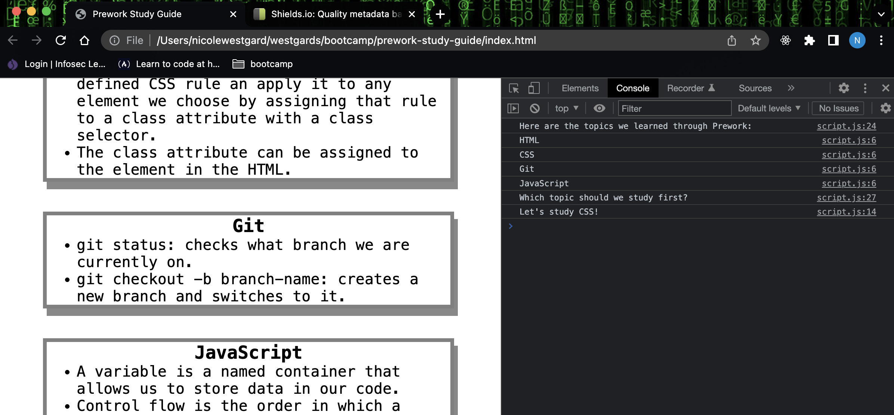

# Prework Study Guide Webpage
U of MN Coding Bootcamp

## Description

This prework consists of online lessons with hands-on activities. 

The goal of this prework study guide is to familiarize new students with the practices and technical requirements they will need to complete the boot camp.

By completing these lessons, students  will experience the structure and pace of the program through hands-on introductory coding activities.

## Installation

N/A

## Usage

Each section in the web application contains notes about a certain topic, including HTML, CSS, JavaScript, Git. 

 Using Google Chrome's DevTools console, we can see the JavaScript code running. It will list the topics we learned from prework and choose one topic for us to study first.

## Credits
N/A
University of Minnesota Coding Boot Camp
[Prework Modules](https://courses.bootcampspot.com/courses/2685/modules)

## License

Copyright (c) 2022 nico. 

Licensed under the [MIT](https://github.com/westgards/prework-study-guide/blob/main/LICENSE) license.

---

## Features

If your project has a lot of features, list them here.

## Tests

Go the extra mile and write tests for your application. Then provide examples on how to run them here.